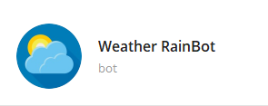

# Weather RainBot
<p align="center">

</p>

O [Weather RainBot](https://t.me/RasaRainBot), é um bot capaz de informar temperatura da cidade solicitada pelo usuário.

---
## ✔️ Objetivo

O objetivo da sprint 4 era desenvolver um chatbot utilizando o framework RASA, para integrar as funcionalidades já desenvolvidas nas sprints anteriores. O desenvolvimento, foi dividido em 4 etapas:

```bot-1 | bot-2 | bot-3 | bot-4```


## 🛠 Dependencias e Instalações Necessárias


- [x] Python 3.7 ou 3.8

- [x] Spacy
    ```
    pip install -U pip setuptools wheel
    pip install -U spacy
    ```
- [x] Rasa

    Ubuntu:
    ```sh
    python3 -m venv ./venv
    source ./venv/bin/activate
    pip3 install -U --user pip && pip3 install rasa
    ```
    macOS:
    ```sh
    python3 -m venv ./venv
    source ./venv/bin/activate
    pip3 install -U --user pip && pip3 install rasa
    ```
    Windows:
    ```sh
    C:\> python3 -m venv ./venv
    C:\> .\venv\Scripts\activate
    pip3 install -U --user pip && pip3 install rasa
    ```

## bot-1 🤖
### Objetivo bot-1
Desenvolver um chatbot utilizando o frameork [Rasa](https://rasa.com/) em conjunto dos modelos do [Spacy](https://spacy.io/) para o processamento de linguagem natural (PLN).
### Etapas
1. Com o Rasa e o modelo do Spacy baixados, precisamos passar os primeiros comandos para iniciar o projeto.

    ```python
    rasa init
    ```
2. Na raiz da pasta ./ temos o arquivo `domain.yml`, podemos dizer que nesse arquivo ao ser alimentado, temos todas as informações que o bot sabe antes mesmo de ser treinado, ou seja, ele sabe o que responder, quais intents existem, quais actions ou custom actions existem, e é onde também declaramos, forms, slots e entities.

3. Após isso, a estrutura do chatbot estará montada, na pasta ./data estão armazenados o nlu.yml, o rules.yml, e o stories.yml, esses arquivos são importantes para o treinamento do chatbot.
    + O `nlu.yml` possui todas as declarações das intents, são previsões de possíveis intensões que o usuário possa ter ao conversar com o bot.
    + O `rules.yml` é onde declaramos as regras para as intents.
    + O `stories.yml`, é onde montamos de forma estruturada possíveis caminhos e conversas que o usuário possa ter com o bot e quais decisões o bot vai tomar dependendo de cada intent.
4. Para o uso da nossa API, criamos dentro do arquivo `actions.py`, todas funções e requisições necessárias.

5. Depois de alimentar e estruturar com informações as intents, rules, e nlu, e domain precisamos treinar o chatbot, para isso passamos o comando:
     ```python
    rasa train
    ```
6. Quando terminado o treino, o Rasa gera uma pasta models onde ficam armazenados todos os modelos de previsão do bot, a partir disso já podemos conversar com o bot através do comando:
     ```python
    rasa shell
    ```
7. Para custom actions, precisamos rodar também o comando:
     ```python
    rasa run actions
    ```
8. Alguns outros comandos foram utilizados também para avaliar as respostas e correspondencias de intensões. Tais como "`rasa shell nlu`", "`rasa interactive`" e etc.

### Como funciona?
O usuário deve informar seu nome e uma cidade para buscar as informações sobre a temperatura. O chatbot retornará as informações via prompt de comando.

---
## bot-2 🤖
### Objetivo bot-2
Utilizar o bot anterior porém (bot-2) agora salvando o nome, as solicitacões do usuário e o retorno da API no banco de dados, validando caso o usuário já tivesse solicitado a mesma informação anteriormente.
### Etapas
Para tal, foi preciso instalar algumas dependencias, como `pymongo` e importar a biblioteca `requests` no arquivo actions.py.

---
## bot-3 🤖
### Objetivo bot-3
Utilizar o bot anterior (bot-4) porém agora precisamos criar os arquivos responsáveis pela criação dos container em Docker. São 3 arquivos, o `docker-compose.yml` serve para especificar as propriedades de cada container, como comando e variaveis de ambiente, ja o `actions.dockerfile` e `bot.dockerfile` serve para especificar alguma particularidades da imagem do serviço de actions e do bot, respectivamente, gerado pelo compose.


### Etapas
Nesse momento, decidi incluir no arquivo `credentials.yml` uma credencial para conectar com o Telegram, através de um token gerado pelo [BotFather](https://t.me/botfather).
Para tal, precisamos ter o Docker instalado na máquina e depois de configurados os parâmetros para cada serviço rodamos o comando:
```python
docker up
```
---
## bot-4 🤖
### Objetivo bot-4
Utilizar o bot anterior (bot-3) porém agora precisamos enviar para plataforma do [Okteto](https://www.okteto.com/) que gerencia os containers através do Kubernetes.
### Etapas
Para tal, foi preciso instalar algumas dependencias, como `Okteto CLI` através do comando:

MacOS / Linux
```sh
    curl https://get.okteto.com -sSfL | sh

    okteto context use https://cloud.okteto.com
```
Windows - (by scoop)
```sh
    scoop install okteto

    okteto context use https://cloud.okteto.com
```

Para fazer o deploy da aplicação, basta passar o comando abaixo:
```sh
    okteto deploy --build
```
## Conclusão
Finalizado o deploy e aguardado alguns minutos a aplicação estará rodando e pode ser conferida através do link [Weather RainBot](https://t.me/RasaRainBot).